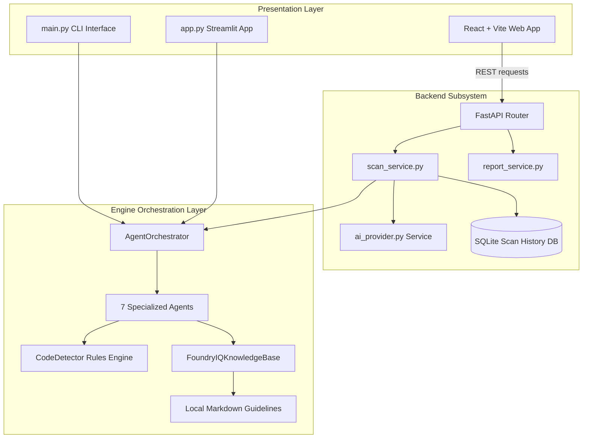

# SecureCode Reasoning Agent 🛡️

**A Microsoft Agents League Hackathon Project**  
**Track:** Reasoning Agents  
**Concept:** Microsoft Foundry Alignment & Local Grounding Integration Platform (MVP)

---

## 📖 Tagline
Autonomous multi-agent code security intelligence powered by a "Foundry IQ-inspired local grounding layer with planned Microsoft Foundry integration" and automated unit test validation.

---

## 🚨 Problem Statement
In modern DevSecOps, standard static analysis (SAST) tools generate dry, context-less alerts. Developers waste valuable time researching vulnerabilities, seeking correct secure patterns, translating rules into remediation, and writing tests to verify the fixes. This gap results in delayed fixes and insecure software releases.

---

## 💡 Solution Overview
**SecureCode Reasoning Agent** is an autonomous multi-agent platform designed to analyze Python and JavaScript source code, detect security flaws, reason about the underlying risks, retrieve secure coding patterns from local guidelines, generate code remediation, and compile executable unit tests to validate both the exploit and the fix.

The system is fully offline-first by default, storing its scan run histories in SQLite database logs, and compiling professional security reports in Markdown and JSON formats.

---

## 🛠️ System Architecture

Our platform consists of three main subsystems:
1.  **Frontend Dashboard**: React + Vite + TypeScript web interface styled with Microsoft corporate design components.
2.  **FastAPI Backend**: Implements RESTful health, scan, database persistence, and report export services.
3.  **Multi-Agent Reasoning Engine**: Features 7 cooperative autonomous agents performing structured analysis grounded in mock Foundry IQ docs.



---

## 🤖 Multi-Agent Workflow
Our architecture dispatches seven cooperative agents in sequence:
1.  **CodeUnderstandingAgent**: Reads code file structure, determines languages, and parses function definitions.
2.  **SecurityRiskAgent**: Scans source code using deterministic rules to register raw findings.
3.  **ReasoningAgent**: Grounded in mock local guidelines (OWASP, secure coding, validation), it produces structured explainable reasoning logs.
4.  **RemediationAgent**: Generates clean, secure code replacement blocks.
5.  **ValidationAgent**: Generates unit test suites in pytest or jest formats.
6.  **CriticVerifierAgent**: Performs quality check reviews on remediation recommendations and test accuracy.
7.  **ReportAgent**: Compiles findings and traces into final report files under `reports/`.

---

## 🌟 Microsoft Foundry & Foundry IQ Alignment
-  **Explainable Reasoning**: Rather than exposing raw LLM chain-of-thought, the Reasoning Agent structures explanations under clear sections: Observed Evidence, Violated Principle, Potential Impact, Severity Justification, and Fix Strategy.
-  **Grounding Integration**: Simulates the Microsoft Foundry IQ concept by matching security risks against local guidelines markdown files for RAG-like grounding.
-  **Data Privacy & Responsible AI**: Runs completely locally to keep code secure, resolving scans locally and persistently. Supports optional enhancement via Azure OpenAI or OpenAI if credentials are provided in the environment.

---

## 📊 Evaluation Framework & Benchmark Suite v1.0
To quantitatively validate detection accuracy, retrieval quality, and remediation efficacy, the platform includes a complete **AI Quality & Evaluation Framework** aligned with Azure AI Foundry evaluation practices.

### 1. Key Evaluation Metrics
The framework executes automated, deterministic benchmark runs evaluating:
- **Detection Quality**: Precision, Recall, F1-Score, Accuracy, False Positive Rate (FPR), False Negative Rate (FNR), and Average Detection Coverage across categories.
- **RAG Grounding & Retrieval**: Grounding Success Rate (percentage of findings with valid references), Citation Coverage, Vector Similarity Score, and Average Chunk Count.
- **Remediation & Validation**: Efficacy rates of generated code fixes and validation unit tests.
- **Agent Pipeline Reliability**: Agent execution success/failure rates and pipeline completion rates.

### 2. Deterministic Dataset Generation
Rather than committing bloated files, the evaluation suite features a dynamic, template-driven generator:
- **Output**: 200 synthetic files (100 Vulnerable, 100 Safe cases) across 10 security categories (SQL Injection, Hardcoded Secrets, Weak Hashing, Unsafe Eval, Command Injection, Path Traversal, Insecure Randomness, Disabled TLS Verification, Permissive CORS, XSS) in Python and JavaScript.
- **On-Demand Generation**: Generated dynamically on execution or test runs to avoid repository bloat.

### 3. How to Run Benchmarks
You can run the benchmark suite from the CLI or directly via the **Evaluation Center** tab in the React Web Dashboard:
- **Offline Mode (Bypasses API costs with local rules & mock models)**:
  ```powershell
  python evaluation/benchmark_runner.py --mode offline --limit 200
  ```
- **Live Mode (Integrates with live LLMs and Azure AI Foundry)**:
  ```powershell
  python evaluation/benchmark_runner.py --mode live --limit 200
  ```
All runs save historical records (`evaluation/benchmark_history/run_*.json`) which are rendered as interactive trend lines and gauges in the UI. A print-to-PDF layout is also provided for executive compliance reporting.

---

## 📂 Folder Structure
```text
SecureCode-Reasoning-Agent/
│
├── backend/                          # FastAPI REST API Backend
│   ├── api/                          # Endpoints (health, scan, reports)
│   ├── core/                         # Config, Logging
│   ├── db/                           # SQLite Database & Repositories
│   ├── models/                       # Pydantic Schemas
│   ├── services/                     # Processing Services & AIProvider
│   ├── Dockerfile                    # Containerization
│   └── requirements.txt              # Backend dependencies
│
├── frontend/                         # React + Vite + TypeScript Frontend
│   ├── src/                          # Source code (components, API)
│   ├── package.json                  # Scripts & NPM packages
│   └── vite.config.ts                # Vite config
│
├── agents/                           # Autonomous Agents Engine
├── detectors/                        # Deterministic rules scanning
├── knowledge/                        # Grounding Markdown guidelines
├── knowledge_base/                   # Grounding engine interface
├── orchestrator/                     # Coordinates workflow execution
├── samples/                          # Vulnerable & Safe templates
├── tests/                            # Pytest test suite
├── reports/                          # Compiled reports folder
├── app.py                            # Streamlit Web App Presentation
├── main.py                           # CLI Presentation Interface
└── requirements.txt                  # Engine dependencies
```

---

## 🚀 How to Run Locally

### 1. Installation
Clone the repository:
```powershell
pip install -r requirements.txt
```

### 2. Run Automated Pytest Tests
```powershell
pytest tests/
```

### 3. Run the Production-Grade Web Platform (FastAPI + React)

#### Start the FastAPI Backend:
```powershell
cd backend
python -m venv .venv
.venv\Scripts\activate
pip install -r requirements.txt
uvicorn main:app --reload --port 8000
```
*Check API health at `http://localhost:8000/health`.*

#### Start the React Frontend:
```powershell
cd frontend
npm install
npm run dev
```
*Open `http://localhost:5173` in your browser to view the interactive dashboard.*

### Production deployment
- Render backend blueprint: `render.yaml`
- Vercel SPA config: `frontend/vercel.json`
- Render free mode uses ephemeral SQLite storage for demo deployments
- Full guide: `docs/DEPLOYMENT.md`

### 4. Run the Streamlit Dashboard App (Optional)
```powershell
streamlit run app.py
```

### 5. Run the CLI Demo (Optional)
```powershell
python main.py --file samples/vulnerable_python.py
```

---

## ⚡ Demo Script (3-Minute Hackathon Flow)
For a structured 3-minute presentation, please review the complete walkthrough guide at [docs/DEMO_SCRIPT.md](file:///c:/Users/SantiagoPanchi/SecureCode-Reasoning-Agent/docs/DEMO_SCRIPT.md).

---

## 🔒 Security, Responsible AI and Data Safety
-   **Local Isolation**: Scans run completely offline by default. No source code content is transmitted to cloud services.
-   **Optional AI Enhancement**: When configured, API calls to Azure OpenAI are used purely to enrich summaries, remediations, and reviews. All core analysis remains local.

---

## 🗺️ Roadmap
-  Integrate with local LLM runtimes (Ollama, local llama.cpp).
-  Add native CI/CD webhook connectors for Azure DevOps and GitHub Actions.
-  Connect to Microsoft Defender for Cloud APIs to report enterprise compliance scores.

---

## ⚠️ Disclaimer
This is a hackathon MVP demonstration project. It uses mock/synthetic data models and rule-based regex patterns for demonstration purposes. Do not use in production deployments without configuring commercial static analysis engines.
